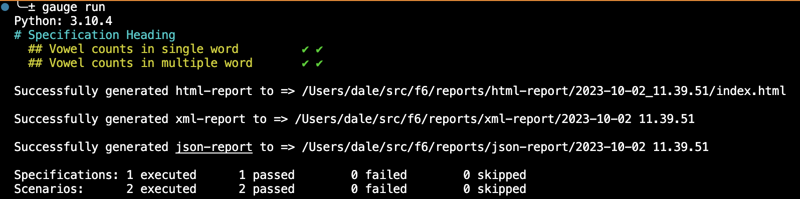

# Automation Framework

## Walkthrough

#### Prequisitions

**`Python 3.10.4`**

**`Gauge version: 1.5.4`**

**`VSCode Editor`** or **`Pycharm Editor`**

#### Installation
1. Clone project
2. Create new virtual environment with `python -m venv venv`
3. Activate virtual environment `source venv/bin/activate`
4. Install all required libs with `pip install -r requirements.txt`
5. Verify you are already with `gauge run` you should see as below
  

## How to Use

#### Usage

##### Unittest

Run scenarios tagged as TAG_1, using 4 parallel processes:

`behavex -t @TAG_1 --parallel-processes 4 --parallel-scheme scenario`

#### Code Convention